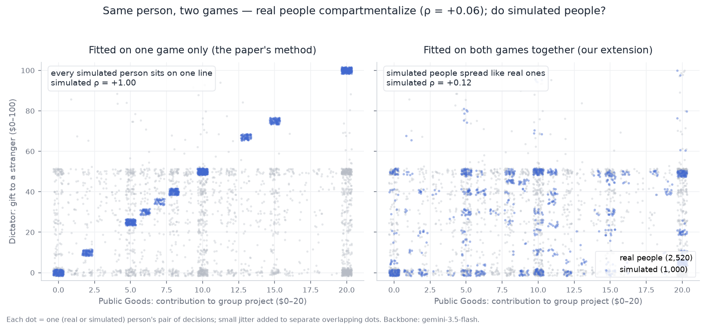

# Independent Reproduction of "Distributional Alignment for Social Simulation with LLMs" (KDD 2026)

Reproduction and extension of Xie, Gao & Mei, *Distributional Alignment for
Social Simulation with LLMs: A Mixture Modeling Approach* (KDD 2026, DOI
10.1145/3770855.3818919), performed August 29–31, 2026 against this
repository's released code and artifacts. Backbones: the paper's exact GPT-4o
snapshots (`gpt-4o-2024-05-13`, `gpt-4o-mini-2024-07-18`, via OpenRouter) and
two Gemini models (`gemini-3.5-flash`, `gemini-pro-latest`, via Google's
OpenAI-compatible endpoint).

This document is organized around five findings; each summary below links to
its evidence section. Operational details (setup deviations, environment
practicalities, how to re-run everything, artifact index) are in
[APPENDIX.md](APPENDIX.md).

## Executive summary — five findings

**[1. The paper checks out.](#finding-1--the-paper-checks-out)** Its released
artifacts recompute to the published tables (7 games x 2 algorithms);
replaying its prompts with fresh API calls matches; a full from-scratch refit
on the exact GPT-4o snapshot — done for one game, Public Goods — beats the
published number (W-dist 0.43 vs 0.47). Seven release bugs had to be fixed to
run the code at all.

**[2. Prompts transfer across models if you refit the weights (using the
paper's own weight-optimization step).](#finding-2--prompts-transfer-weights-must-be-refit)**
GPT-4o's fitted personas moved to Gemini flash: keeping GPT-4o's weights,
W-dist 2.04–2.17 (failure); refitting only the weights from ~10 flash samples
per persona, **0.57**; full refit from scratch, 0.31. About 80% of the
transfer gap closes with ~80 API calls instead of a full refit. (Both Gemini
tiers fail identically without reweighting — the mis-calibration is
family-shared.)

**[3. With a crafted system prompt, Gemini is perfectly deterministic — which
makes the method work *better* than on GPT-4o while changing what it
means.](#finding-3--gemini-personas-are-deterministic-the-mixture-is-a-lookup-table)**
Every fitted persona gives one exact answer 100% of the time (survives
temperature 2.0; personas have *less* variance than no persona at all). The
mixture becomes a weighted lookup table — and it beats the paper's GPT-4o
results on **all 7 games** (e.g. Banker 3.34 vs 9.36). Catch: the paper's
metrics cannot tell a lookup table from a population of person-like agents —
and rate the lookup table higher.

**[4. EM beats GB on deterministic models, 7/7 — reversing the
paper.](#finding-4--em-beats-gb-on-deterministic-models)** GB never moves a
component after placing it; EM re-places them every iteration. When
components are frozen dots, placement is everything, so the relocating
algorithm wins.

**[5. Extending from 1D to 2D: proposed-but-untested in the paper; we ran
it.](#finding-5--from-1d-to-2d)** `data/joint.csv` records the same
participant's decisions across up to 7 games (pairwise overlap 2,500–5,300
people), so this extends in principle to 7D; we ran the 2-game case:
**Public Goods** (contribute $0–20 to a group project) x **Dictator** (give
$0–100 to a stranger). The 1D-fitted personas imply a society where one
behavior perfectly predicts the other (correlation +1.00 vs the human +0.06);
fitting both games together fixes it (+0.055 vs +0.057), at a measurable
per-game precision cost.

---

## Finding 1 — The paper checks out

### Recomputing the published tables from released artifacts

The authors' five stability runs (`intermediate_results/Algorithmic_stability/`)
contain the final simulated samples for all 7 MobLab games under both
algorithms. Recomputing the Wasserstein distance against the human data
(`data/joint.csv`) reproduces Table 2 within run-to-run spread:

| Game | EM 5 runs (mean ± std) | EM Table 2 | GB 5 runs (mean ± std) | GB Table 2 |
|---|---|---|---|---|
| Dictator | 1.86 ± 0.59 | 1.69 | 1.95 ± 0.12 | 1.17 |
| Proposer | 2.79 ± 0.86 | 1.39 | 1.88 ± 0.18 | 1.88 |
| Responder | 3.39 ± 1.12 | 3.05 | 2.64 ± 0.08 | 2.51 |
| Investor | 2.33 ± 0.56 | 1.75 | 2.26 ± 0.39 | 1.84 |
| Banker | 6.82 ± 2.29 | 9.36 | 4.81 ± 0.97 | 4.24 |
| Public Goods | 0.72 ± 0.14 | 0.47 | 1.00 ± 0.25 | 0.88 |
| Bomb | 7.78 ± 2.66 | 6.32 | 6.18 ± 1.28 | 4.59 |

Every value is far below all unaugmented baselines in Table 2. The WVS
Emancipative Values Index pipeline was also verified: recomputing it from the
raw WVS Wave 7 CSV gives mean 43.49 / std 18.22 (96,529 valid respondents)
vs. the paper's 43.76 / 18.29.

### Replaying the authors' fitted prompts with fresh API calls

Saved system prompts from EM stability run 0, Public Goods (weights are not
shipped, so they were re-fitted from 10 fresh samples per prompt), then 1,000
fresh evaluation samples:

| Metric | This replay | Authors' 5 runs | Table 2 |
|---|---|---|---|
| Wasserstein | **0.57** | 0.59–0.95 | 0.47 |
| sim mean / std | 9.89 / 6.40 | — | — |
| human mean / std | 9.63 / 6.44 | — | — |
| Wilcoxon rank-sum | pass (p = 0.195) | — | pass |
| Kolmogorov–Smirnov | fail | — | fail |

### Fitting the mixture from scratch on the paper's own backbone

`EM_moblab.py --game Public_Goods --K 10 --runs 1`, end-to-end on an
independent account: random initialization, GPT-4o prompt-crafting loop, 5 EM
iterations, weight optimization; evaluated with 1,000 fresh samples under its
own fitted weights:

| Metric | From-scratch fit | Table 2 | Human floor (1,000 samples) |
|---|---|---|---|
| Wasserstein | **0.43** | 0.47 | 0.13–0.40 |
| sim mean / std | 9.56 / 6.25 | — | human: 9.63 / 6.44 |
| Wilcoxon rank-sum | pass (p = 0.918) | pass | — |
| Kolmogorov–Smirnov | fail (p = 0.0013) | fail | — |

The independently fitted mixture slightly outperforms the published number
and is statistically indistinguishable from the 19,109 human decisions under
the rank-sum test. The learned components are interpretable personas spanning
free-riders, strategic contributors, and altruists, mirroring the paper's
interpretability claims.

### Release bugs fixed

Seven defects prevented the released code from running as shipped: the MobLab
data path, `argparse` attribute mismatches in three `main()` functions, a
`gb_run` keyword error, missing output directories, a `'Public Goods'` vs
`'Public_Goods'` key mismatch, and pandas ≥ 3 `applymap` removal. See git
history on this branch.

---

## Finding 2 — Prompts transfer; weights must be refit

The level-3 GPT-4o mixture (prompts *and* weights) replayed unchanged on
Gemini, 1,000 fresh samples per run:

| Configuration | W-dist | mean / std | Wilcoxon |
|---|---|---|---|
| GPT-4o prompts + GPT-4o weights, on GPT-4o | 0.43 | 9.56 / 6.25 | pass |
| GPT-4o prompts + GPT-4o weights, on flash | 2.17 / 2.04 (two runs) | 11.6 / 7.3 | fail |
| GPT-4o prompts + GPT-4o weights, on pro | 1.81 | 11.0 / 7.7 | fail |
| Authors' prompts + weights refit from 10 flash samples each, on flash | **0.57** | 9.89 / 6.40 | pass |
| human | — | 9.63 / 6.44 | — |

Per-component attribution localizes the transfer failure exactly. Each
component was crafted to hit a target contribution; on flash:

| component | weight | target | Gemini mean | persona |
|---|---|---|---|---|
| 0 | 0.138 | 0 | 0.00 | highly cautious, minimizes contributions |
| 7 | 0.083 | 1 | 1.11 | conserves resources |
| 9 | 0.158 | 8 | 7.69 | conservative yet cooperative |
| 8 | 0.099 | 9 | 10.67 | rational maximizer |
| 5 | 0.079 | 8 | 10.03 | calculated, resource-conscious |
| 1 | 0.092 | 13 | 14.24 | strategic optimizer |
| 4 | 0.090 | 12 | 18.96 | strategic and thoughtful cooperator |
| **2** | **0.235** | **14** | **20.00** | highly collaborative altruist |
| 3 | 0.014 | 15 | 20.00 | cooperative optimist |
| 6 | 0.011 | 14 | 20.00 | insightful and generous |

Low- and mid-target components transfer almost perfectly; every component
targeting ≥ 12 saturates at exactly $20. Gemini reads "be generous" as
maximal where GPT-4o produces graded values — and **pro fails identically to
flash** (34.1% vs 34.0% of samples at $20, same components saturating), so
persona→behavior calibration is a model-family trait, not a capability
effect.

The repair is the paper's own weight-optimization step, re-run against ~10
samples per persona from the *new* backbone (~80 calls total): W-dist drops
from 2.04–2.17 to 0.57. A full refit (finding 3) reaches 0.31 — so weight
recalibration alone recovers about 80% of the gap.

---

## Finding 3 — Gemini personas are deterministic; the mixture is a lookup table

### From-scratch refits: the method self-corrects on every backbone — and the cheap model wins

Public Goods, EM K=10, all three backbones:

| Backbone | fitted W-dist | mean/std (human 9.63/6.44) | Wilcoxon |
|---|---|---|---|
| GPT-4o | 0.43 | 9.56/6.25 | pass |
| gemini-3.5-flash | **0.31** | 9.64/6.43 | pass (p=0.94) |
| gemini-pro-latest | 0.44 | 9.32/6.45 | pass (p=0.15) |

Full flash matrix — EM and GB, all 7 MobLab games (W-dist, 1,000 fresh
samples vs full human data):

| Game | flash EM | paper EM | flash GB | paper GB |
|---|---|---|---|---|
| Dictator | **0.68** | 1.69 | 2.63 | **1.17** |
| Proposer | **1.05** | 1.39 | **1.80** | 1.88 |
| Responder | **1.65** | 3.05 | **1.82** | 2.51 |
| Investor | **1.56** | 1.75 | 2.77 | **1.84** |
| Banker | **3.34** | 9.36 | **3.36** | 4.24 |
| Public Goods | **0.31** | 0.47 | **0.85** | 0.88 |
| Bomb | **1.48** | 6.32 | **1.89** | 4.59 |

Flash EM beats the paper's GPT-4o EM on 7/7 games (Dictator lands below that
run's 1,000-human-sample floor of 1.04). Pro, run on a focused subset:

| Pro run | W-dist | notes |
|---|---|---|
| EM Public Goods (K=10) | 0.44 | Wilcoxon pass |
| EM Dictator (K=50) | **0.49** | vs paper 1.69, human floor 0.39 |
| EM Banker (K=50) | **2.22** | best Banker in the study (paper: 9.36) |
| GB Dictator (maxIter=60) | 2.42 | Wilcoxon pass |

### The mechanism: deterministic atoms

Per-component attribution over the evaluation samples:

- Flash EM Public Goods: **10/10 components zero-variance** — each persona
  always answers one exact number. Support = exactly K values; entropy 3.19
  bits vs human 3.96. GPT-4o's mixture: 18 distinct values from K=10, with
  real within-component spread.
- Pro EM Public Goods: 10/10 zero-variance. Pro EM Dictator (K=50, 101-value
  action space): 48/49. Pro EM Banker: 37/37. Pro GB Dictator: 18/18.
- Flash GB Dictator/Banker/Bomb: 17/18, 22/22, 22/26.

All the diversity in a Gemini mixture comes from the weights: the fitting
loop learns a K-atom quantization of the human histogram. Wasserstein, mean,
std, and Wilcoxon are all blind to the difference — the quantization
*outscores* the persona population on every one of them. Only support size /
entropy (or, weakly, KS) expose it. For social simulation — sampling a
persona and interacting with it — the two mixtures are different objects:
noisy person-like agents vs a lookup table in persona costume.

### Determinism is not a sampling artifact

A fitted flash persona answers identically 10/10 even at temperature 2.0
(Gemini's maximum). The mechanism is deliberation: thinking models converge
to the persona's "correct" answer regardless of sampling randomness, and the
crafting loop selects for prompts that pin the mode. Response diversity on
deliberative models is a prompting property, not a sampling property.

### Personas remove variance rather than add it

Fixed-prompt baseline ("You are a helpful assistant.", 1,000 samples): flash
W-dist 4.02 (std 2.56 — 4 distinct values, 59.6% at $10); pro 3.49 (std 4.05
— 3 distinct values, 80% at $10); paper's GPT-4o value 5.04. The *default*
prompt has more within-prompt variance than any crafted persona (std 0.00) —
on Gemini, personas are precision instruments, not diversity generators, and
the smarter tier collapses harder by default.

---

## Finding 4 — EM beats GB on deterministic models

Within flash, EM ≤ GB on **all seven games** (see the matrix in finding 3),
reversing the paper, where GB often won. On pro the gap is wider still: EM
Dictator 0.49 vs GB Dictator 2.42 on the same game.

The mechanism follows from finding 3: when components are frozen dots,
placement is everything. EM's E-step relocates components every iteration;
GB's greedy additive scheme cannot move a component once placed — it can only
down-weight early mistakes. GB's two losses to the paper (Dictator, Investor)
are exactly the spikiest human distributions, where early misplacement costs
most. (Flash GB ran at maxIter=60 rather than the paper's 200; the paper's
own convergence analysis shows GB stabilizes by ~30 prompts.)

---

## Finding 5 — From 1D to 2D

The paper fits each game separately and mentions multi-attribute joint
fitting only as future work. `data/joint.csv` records the same participant's
decisions across games, providing ground truth. Human cross-game consistency
is context-dependent: Spearman +0.291 across the two ultimatum roles
(Proposer x Responder, n=5,291) but only +0.057 across different games
(Public Goods x Dictator, n=2,520) — real people compartmentalize.

### Stage A — what the 1D-fitted personas imply about the joint

Sample personas from a fitted mixture; each plays both games (independent
calls); compare the induced joint to the human joint (2D earth-mover distance
on normalized coordinates; the shuffle baseline destroys within-persona
coupling while preserving both histograms):

| Arm (mixture used) | human rho | sim rho | EMD sim | EMD shuffle | EMD reweighted | floor |
|---|---|---|---|---|---|---|
| flash PG-mixture, PG x Dictator | +0.057 | **+1.000** | 0.319 | 0.241 | 0.264 | 0.030 |
| gpt-4o PG-mixture, PG x Dictator | +0.057 | +0.786 | 0.186 | 0.155 | 0.177 | 0.032 |
| flash Proposer-mixture, Prop x Resp | +0.291 | **+0.295** | 0.075 | 0.078 | 0.069 | 0.027 |

Deterministic personas produce *perfect* rank correlation — each is one 2D
dot, and trait-ordering lines the dots up; GPT-4o's within-persona noise only
softens this to +0.79. On the near-independent pair the persona coupling is
*worse than assuming independence* (shuffle beats sim for both backbones).
Persona trait-consistency is roughly constant across contexts while humans'
is context-dependent — the same mechanism that ruins PG x Dictator almost
exactly reproduces Proposer x Responder.

### Stage B — reweighting cannot fix it

With components fixed, optimal weights reduce to assigning each human pair to
its nearest persona dot. It barely helps (0.319 → 0.264 on flash;
correlation stays +1.0): all dots lie on the "consistent character" diagonal,
and no reweighting can create the off-diagonal people (generous in one
context, selfish in the other) who dominate the real joint. A coverage
failure, not a calibration failure.

### Stage C — fitting both games together fixes it

Crafting against the human *joint* — targets placed by clustering the real
pairs, and one change to the crafting instruction: describe people who *may
behave differently* in group vs one-on-one settings (`code/craft2d.py`):

| PG x Dictator | 1D mixture | joint fit K=25 | joint fit K=100 | human |
|---|---|---|---|---|
| Spearman | +1.000 | +0.042 | +0.055 (reweighted) | +0.057 |
| 2D EMD | 0.319 | 0.055 | **0.040** | floor 0.032 |

The crafted personas hit off-diagonal targets exactly (e.g. contribute
$10/20 in Public Goods, give $0/100 in Dictator); correlation becomes
statistically indistinguishable from human; the K=100 fit presses against the
evaluation's own sampling resolution. K was chosen by numerically quantizing
the human pair data first (classical k-means / vector quantization — the
K-vs-quality curve is computable with zero API calls, and the K=25 crafted
fit ran at ~96% of its theoretical optimum; details in the appendix).
Notably, prompting for context-dependence also partially restores
within-persona behavioral noise (13/23 personas non-deterministic).

**The price:** viewed game-by-game, the joint fit's histograms are ~1.5–2x
worse than dedicated single-game fits (Public Goods 0.47 vs 0.31; Dictator
1.56 vs 0.68) — on par with the paper's published GPT-4o quality, below our
best 1D fits. One fit that gets the *combinations* right, versus separate
fits that get each game sharpest and the combinations entirely wrong.

---

## Verdict

The paper's central claim — that a learned mixture of system prompts
reproduces human distributional heterogeneity at near-sampling-noise fidelity
— held at every level tested, on every backbone tested, including full
from-scratch refits on an independent account (finding 1, finding 3).

Its fitted artifacts are backbone-specific even though the method is not:
transfer fails without weight recalibration, and the failure is shared across
a model family (finding 2).

The deeper qualifications are mechanistic. On the Gemini family the method's
excellent aggregate alignment is achieved by a deterministic K-atom
quantization rather than a population of behaviorally noisy personas, and
none of the paper's evaluation metrics can distinguish the two (finding 3);
the choice of algorithm interacts with that mechanism (finding 4); and the
1D-fitted mixtures imply joint behavior no human population has, which only a
joint-aware refit — not reweighting — repairs (finding 5). Distributional
alignment (population level) and simulation fidelity (individual level) come
apart, and the paper's evaluation framework measures only the former.

Operational details, environment practicalities, commands to re-run
everything, and the artifact index: [APPENDIX.md](APPENDIX.md).
